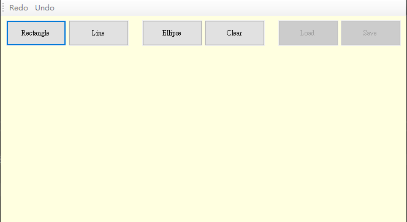
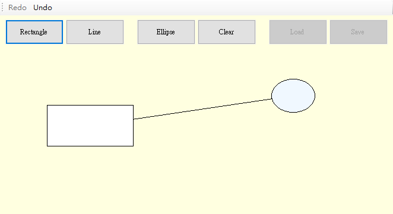

# WindowsForm_PartII

這是一個使用 C# 製作的 Windows Form 應用程式，主要功能是

## 專案目的

此專案為課堂作業，目的是練習 C# 與 Windows Form 的使用

## 技術細節

- 語言：C#
- 框架：Windows Forms (WinForms)

## 頁面展示

### 畫布介面

- 畫布可以繪畫矩形以及橢圓形，並且可以一鍵清除，並提供Redo以及Undo功能
- 儲存以及讀取功能目前暫不啟用

